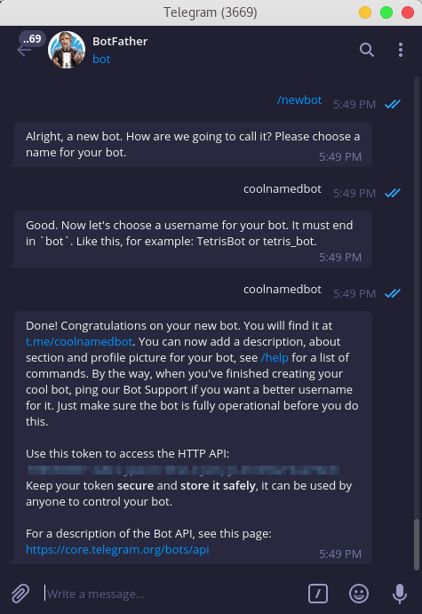
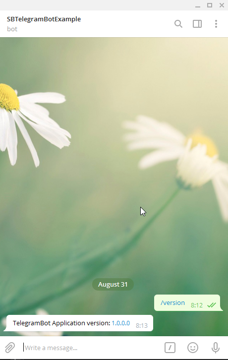

# .NET Client for Telegram Bot API

[](https://www.nuget.org/packages/SB.TelegramBot)
[](https://t.me/joinchat/CZEOHxilcpIVWL3x_MiKpQ)

[](https://www.nuget.org/packages/SB.TelegramBot)

## 🔨 Getting Started

## Create the bot on telegram first



## Namespace
-------
```csharp
using SB.TelegramBot;
```
## Run telegram bot application
-------
```csharp
public static void Main()
{
    TelegramBotApplication.Run("teleram bot token here");

    Console.WriteLine("Telegram bot started!");
    Console.WriteLine("Press enter to close!");
    Console.ReadLine();
}
```
## Now go to your bot


